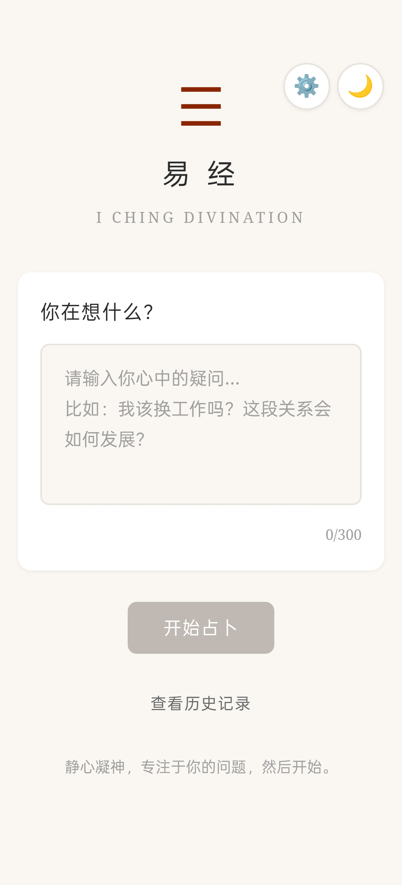
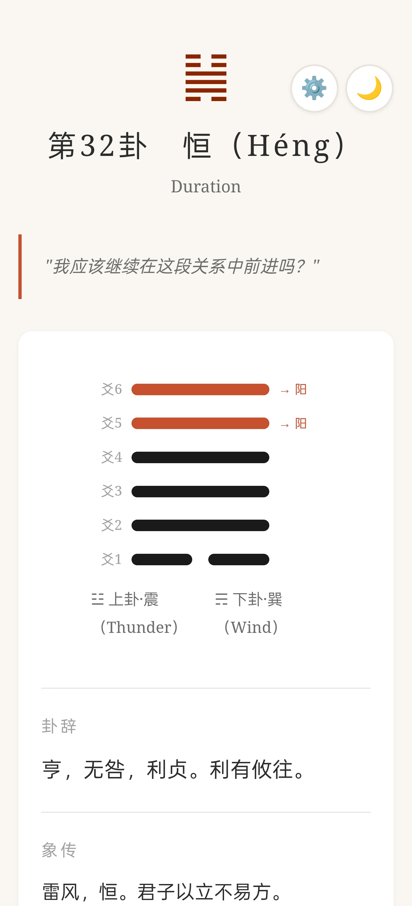
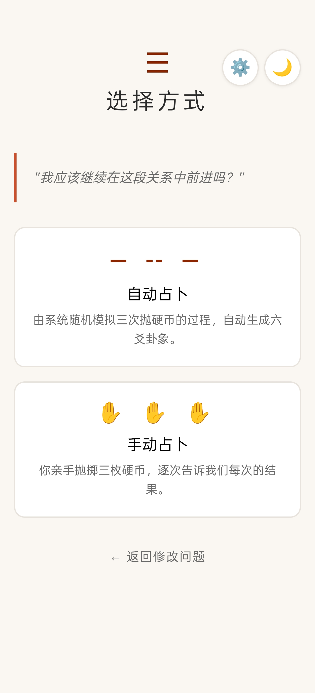
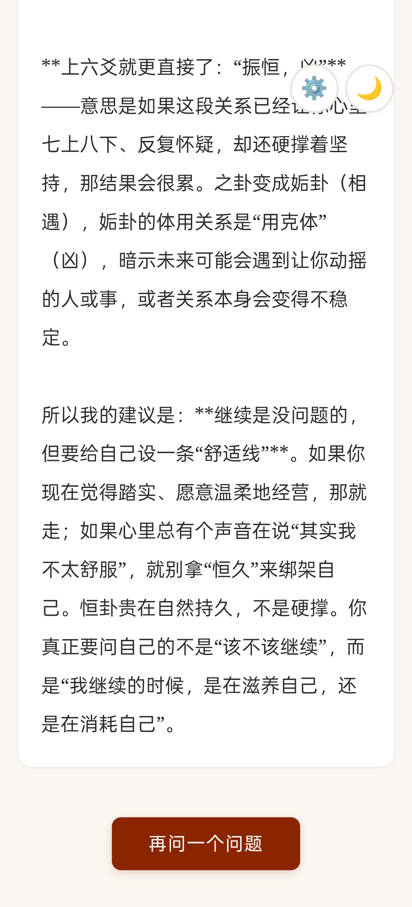

# 易经 · I Ching

一个以易经六十四卦为核心的传统文化应用。输入你正在思考的问题，通过模拟三枚铜钱起卦，获得卦辞、爻辞、体用生克分析及个性化解读。

**核心功能完全本地运行，无需网络。AI 深度解读为可选增强，由用户自行配置 API。**

---

## 能做什么

### 起卦
- **自动起卦**：系统随机模拟三枚铜钱抛掷六次，生成六爻卦象，带逐爻构建动画
- **手动起卦**：你亲手抛硬币，逐次输入每次的结果（三正 / 两正一反 / 一正两反 / 三反）

### 解卦
- **卦辞 + 象传**：六十四卦完整原文
- **体用生克分析**（梅花易数核心）：八卦配五行，分析你（体卦）与外部环境（用卦）的五行生克关系——环境在滋养你、还是在消耗你？
- **变爻解读**：每个动爻的位置含义（从初爻的"根基"到上爻的"结局"），结合爻辞给出对应你问题的白话解释
- **之卦趋势**：变爻阴阳互换后的新卦象，对比本卦与之卦的体用变化，判断事情走向
- **12 领域适配**：根据你问题中的关键词，自动匹配到事业、感情、家庭、健康、财富、决策、学业、出行、创作、冲突、精神、社交等场景，给出针对性的白话建议

### AI 深度启示（可选）
- 连接任意兼容 OpenAI 接口的大模型（OpenAI / DeepSeek / Gemini / 硅基流动 / 本地 Ollama）
- 在设置面板填入 API Key、Base URL、模型名称，点击保存自动测试连接
- 配置后，结果页出现"启示"按钮，点击即调用 AI 结合你的问题和卦象做深度解读
- AI 解读内容自动保存到历史记录

### 历史记录
- 每次占卜自动保存（问题、时间、卦象、变爻、AI 解读）
- 存储满时渐进降级，防止数据丢失
- 点击任意记录查看完整卦象详情（含卦辞、爻辞、之卦、启示）

### 主题
- 深色 / 浅色模式
- 自动跟随系统偏好，也可手动切换，选择会记住

---

## 截图

<div align="center">
  
  
  
  
</div>

> 依次：输入问题 → 选择起卦方式 → 卦象解读结果 → 历史记录

## 运行方式

### 浏览器（PWA）

https://JINGANJP.github.io/iching

支持 PWA 安装：手机浏览器打开 → 添加到主屏幕 → 离线可用。

### Android APK

点击右侧release下载
https://github.com/JINGANJP/iching/releases

APK 为 WebView 壳，加载本地 HTML/CSS/JS，不需要网络权限即可运行全部核心功能。

---

## 技术架构

```
index.html          — 语义化 HTML
app.js              — UI 状态机（6 阶段流程）+ 历史管理 + 主题 + API 测试
iching-data.js      — 八卦/六十四卦数据 + 起卦算法 + 体用生克分析
styles.css          — 禅意极简样式 + 深色模式（CSS 自定义属性）
sw.js               — Service Worker 离线缓存
manifest.json       — PWA 清单
icon.svg            — 八卦阴阳鱼矢量图标
js/
  settings.js       — API 设置管理（localStorage）
  advice-engine.js  — 本地解卦引擎（领域分类 → 体用白话 → 变爻 → 趋势 → 收尾）
  api-client.js     — AI 接口客户端（OpenAI 兼容协议，30s 超时，错误分类处理）
```

- 零前端依赖，纯原生 JavaScript，IIFE 模块化
- 数据持久化：localStorage（设置、历史、主题偏好）
- AI 接口：任意 OpenAI-compatible `/chat/completions` 端点，API Key 仅保存在浏览器本地

---

## 起卦原理

三枚铜钱，每枚正面 = 3，反面 = 2，三枚之和决定每爻：

| 结果 | 值 | 名称 | 含义 |
|------|-----|------|------|
| 三正 | 9 | 老阳 | 阳爻，将变为阴 |
| 两正一反 | 8 | 少阴 | 阴爻，不变 |
| 一正两反 | 7 | 少阳 | 阳爻，不变 |
| 三反 | 6 | 老阴 | 阴爻，将变为阳 |

六次从下往上排，下三爻组成下卦，上三爻组成上卦。老阳/老阴为变爻，阴阳互换得之卦。

---

## 隐私

- 所有占卜数据保存在浏览器 localStorage，不上传任何服务器
- AI 功能的 API Key 仅存储在本地，请求直接发送到用户指定的 API 端点
- APK 版本不需要网络权限即可使用全部核心功能

## 许可证

MIT
